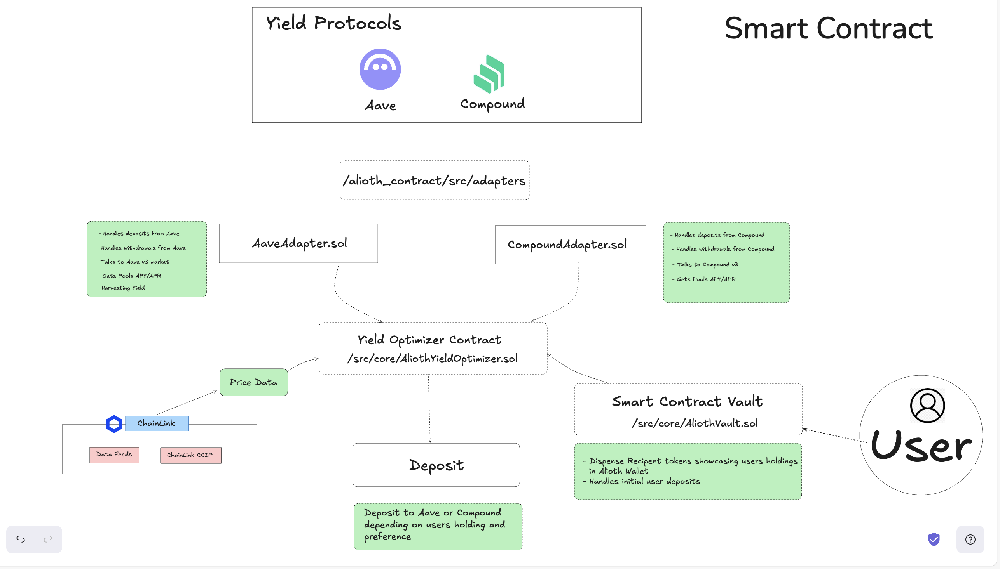

# Alioth ⚡️ – AI-Driven Cross-Chain Yield Optimizer


---

## 🚩 Problem Statement

Today's yield strategies are siloed per chain and rely on unverified off-chain signals. Users face:

1. **Fragmented Liquidity** – Attractive APRs move across chains (and between Aave ⇄ Compound), forcing manual bridging.
2. **Data Integrity Risks** – Bots can feed falsified rates to naïve contracts, leading to mis-allocations or losses.
3. **Cumbersome UX** – Depositing into multiple protocols on multiple chains requires a dozen approvals and UI hops.

---

## 🟢 Solution

Alioth delivers:

1. **Cross-Chain Deposits (Live)** – One transaction deposits and, if needed, bridges assets to Sepolia, Base-Sepolia, or Avalanche Fuji via CCIP.
2. **Protocol Abstraction (Live)** – Uniform adapters expose the same interface for **Aave** and **Compound**.
3. **Chainlink-Verified Recommendations (Live)** – Every AI hint is validated on-chain via fresh price & APY feeds before execution.
4. **Automation for Test Feeds (Live)** – `MockV3Aggregator` keeps demo price feeds fresh with Chainlink Automation.
5. **Automated Rebalancing (Planned)** – Upkeep stubs are ready; v0.2 will introduce on-chain liquidity migration.

<div align="center">
  
</div>

---

## 1️⃣ Why Alioth?

Current yield aggregators are usually locked to a single chain, rely on off-chain cron jobs, and make naïve rebalancing decisions. Alioth solves these issues by combining:

1. **On-Chain Portfolio Logic** – Solidity contracts that hold assets and talk to protocol adapters (Aave, Compound, …).
2. **Chainlink Feeds & Automation** – Reliable APY / price data and keeper-style jobs that trigger rebalances.
3. **Chainlink CCIP** – Trust-minimised cross-chain messaging & token transfers so the optimiser can chase yields on any supported network.

---

## 2️⃣ Contract Overview

```text
alioth_contracts/src
├── core
│   ├── AliothYieldOptimizer.sol   # Main orchestrator
│   ├── AliothVault.sol            # ERC-4626-style vault wrapper
│   ├── CCIPMessenger.sol          # Cross-chain router (CCIP)
│   └── ChainlinkFeedManager.sol   # Manages price / APY / vol feeds
├── adapters
│   ├── AaveAdapter.sol            # Talks to Aave v3 markets
│   └── CompoundAdapter.sol        # Talks to Compound v3
├── libraries
│   ├── DynamicAllocationLib.sol   # (WIP) multi-factor optimiser
│   ├── MathLib.sol                # Fixed-point helpers
│   └── ValidationLib.sol          # Common require helpers
├── mocks
│   └── MockV3Aggregator.sol       # Test oracle with Automation
└── factories
    └── ReceiptTokenFactory.sol    # Minimal-proxy receipt tokens
```

### Core Contracts in Detail

| Contract                                        | Purpose                                                                                                                                                                    | Key Chainlink Usage                                                                                                                                        |
| ----------------------------------------------- | -------------------------------------------------------------------------------------------------------------------------------------------------------------------------- | ---------------------------------------------------------------------------------------------------------------------------------------------------------- |
| **AliothYieldOptimizer**                        | Central brain that holds assets, tracks supported adapters, and decides where funds should go. Handles deposits/withdrawals, maintains APY cache, and executes rebalances. | • Feeds – `getBestProtocolAPY` <br> • Automation – `checkUpkeep` / `performUpkeep` <br> • (WIP) Will call `DynamicAllocationLib` for multi-protocol splits |
| **AliothVault** (ERC-4626)                      | User-facing wrapper that tokenises positions (mints `AliothReceiptToken`). Delegates capital to the Optimizer and enforces slippage checks.                                | • Feeds – price validation on deposits/withdrawals                                                                                                         |
| **ChainlinkFeedManager**                        | Aggregator & registrar for price / APY / volatility feeds. Caches projections for gas efficiency.                                                                          | • Feeds – direct calls to `AggregatorV3Interface`                                                                                                          |
| **CCIPMessenger**                               | Thin wrapper around `RouterClient` that sends/receives liquidity & instructions between chains. Includes allow-lists for dest / source chains and authorised senders.      | • CCIP – token+message send / receive                                                                                                                      |
| **Adapters** (`AaveAdapter`, `CompoundAdapter`) | Protocol-specific wrappers that normalise deposits, withdrawals, TVL, APY, health metrics.                                                                                 | —                                                                                                                                                          |
| **DynamicAllocationLib**                        | Scoring engine that produces weighted allocations from Chainlink data + adapter stats. Integration planned post-hackathon.                                                 | • Feeds – price, APY, volatility                                                                                                                           |
| **MockV3Aggregator**                            | Lightweight on-chain oracle used in demos and unit tests. Can self-update its answer every `interval` seconds via Chainlink Automation.                                    | • Implements `AggregatorV3Interface` <br> • Automation – `checkUpkeep` / `performUpkeep` push new rounds                                                   |

### End-to-End Flow

1. **Deposit** → Vault pulls token, validates price & APY via ChainlinkFeedManager (guarding against stale or malicious AI data), then forwards funds plus the `targetProtocol` hint to the Optimizer.
2. **Allocation** → Optimizer calls the chosen Adapter (**Aave** or **Compound**) on the selected chain.
3. **Automation** → `MockV3Aggregator` self-updates via Automation.
4. **Cross-Chain** → If the chosen chain differs from the origin (Sepolia ⇄ Base-Sepolia ⇄ Fuji), Optimizer sends a CCIP message + token transfer; the destination Optimizer performs the deposit.

---

## 3️⃣ Pre-Deployed Contracts (Testnets)

- **Sepolia**

  - CCIP Messenger: `0x86a89efA6029eFEd8b21cDC0A4760761376c2A47` [verified](https://sepolia.etherscan.io/address/0x86a89efA6029eFEd8b21cDC0A4760761376c2A47#code)
  - AliothYieldOptimizer: `0x3499331d4c0d88028a61bf1516246C29C30AFf8E` [verified](https://sepolia.etherscan.io/address/0x3499331d4c0d88028a61bf1516246c29c30aff8e#code)
  - ChainlinkFeedManager: `0x471e0DC1B324c3bE18B9D6a46cDBdDD6464078A6` [verified](https://sepolia.etherscan.io/address/0x471e0dc1b324c3be18b9d6a46cdbddd6464078a6#code)
  - ReceiptTokenFactory: `0x8f0b22A9284918C0d70BefAaAa56B23fE6b197aE` [verified](https://sepolia.etherscan.io/address/0x8f0b22a9284918c0d70befaaaa56b23fe6b197ae#code)
  - AliothVault: `0x3811F1a5481Ec93ac99d8e76A6FA6C4f6EFd39D4` [verified](https://sepolia.etherscan.io/address/0x3811f1a5481ec93ac99d8e76a6fa6c4f6efd39d4#code)
  - AaveAdapter: `0x2F9F0e0f3B936278983498E85cf022ce0Bb7EF2A` [verified](https://sepolia.etherscan.io/address/0x2f9f0e0f3b936278983498e85cf022ce0bb7ef2a#code)
  - CompoundAdapter: `0x2745490eab4A90a82C80Db969F2Bb2A063c67Dd5` [verified](https://sepolia.etherscan.io/address/0x2745490eab4a90a82c80db969f2bb2a063c67dd5#code)
  - USDC MockAggregator: `0x1ad0B0f24692cddFf368202880F29E99ae38ceC5` [verified](https://sepolia.etherscan.io/address/0x1ad0b0f24692cddff368202880f29e99ae38cec5#code)

- **Base-Sepolia**

  - CCIP Messenger: `0xbd82c2a2AA4c5eAB8D401E0b1362CA4548c7BB45` [verified](https://sepolia.basescan.org/address/0xbd82c2a2aa4c5eab8d401e0b1362ca4548c7bb45#code)
  - AliothYieldOptimizer: `0x9F26D100fdB2Ca6810019062B9a3C6c01Afa21e6` [verified](https://sepolia.basescan.org/address/0x9f26d100fdb2ca6810019062b9a3c6c01afa21e6#code)
  - ChainlinkFeedManager: `0xfB300529C4098A956F5C2f15D7E322717097411f` [verified](https://sepolia.basescan.org/address/0xfb300529c4098a956f5c2f15d7e322717097411f#code)
  - ReceiptTokenFactory: `0x0Cdb58cA678febf3Fb301deAE3377eBc4a897018` [verified](https://sepolia.basescan.org/address/0x0cdb58ca678febf3fb301deae3377ebc4a897018#code)
  - AliothVault: `0x8Ba1D001466b23F844041112E92a07e99Cb439F6` [verified](https://sepolia.basescan.org/address/0x8ba1d001466b23f844041112e92a07e99cb439f6#code)
  - CompoundAdapter: `0x62843F00870d99decd0F720038E35fD5114eFd43` [verified](https://sepolia.basescan.org/address/0x62843f00870d99decd0f720038e35fd5114efd43#code)
  - USDC MockAggregator: `0xbe1fa364A5325fB30F4B8E3eCdc889C59303638a` [verified](https://sepolia.basescan.org/address/0xbe1fa364a5325fb30f4b8e3ecdc889c59303638a#code)

- **Avalanche Fuji**

  - CCIP Messenger: `0x9C62BFe2134C990ef373DF581487d51Eb4Efa989` [verified](https://testnet.snowtrace.io/address/0x9c62bfe2134c990ef373df581487d51eb4efa989#code)
  - AliothYieldOptimizer: `0x2F05369A361e7F452F5e5393a565D4d1cA88F80A` [verified](https://testnet.snowtrace.io/address/0x2f05369a361e7f452f5e5393a565d4d1ca88f80a#code)
  - ChainlinkFeedManager: `0xA4F7c5c3d3fba94Bf77C89bD41818D7662ed9dAE` [verified](https://testnet.snowtrace.io/address/0xa4f7c5c3d3fba94bf77c89bd41818d7662ed9dae#code)
  - ReceiptTokenFactory: `0x6cDb64dDc431814AA36AcfbC50266D7fF2Fb712C` [verified](https://testnet.snowtrace.io/address/0x6cdb64ddc431814aa36acfbc50266d7ff2fb712c#code)
  - AliothVault: `0x5d69494cA5e2B7349B2C81F8acf63E1E15057586` [verified](https://testnet.snowtrace.io/address/0x5d69494ca5e2b7349b2c81f8acf63e1e15057586#code)
  - AaveAdapter: `0x5E4FfA1d7783E2465F7243D86fFC4Fe64011549B` [verified](https://testnet.snowtrace.io/address/0x5e4ffa1d7783e2465f7243d86ffc4fe64011549b#code)
  - USDC MockAggregator: `0xc1Cc14c16D9dF1313F937d10A9c80605818bcDf4` [verified](https://testnet.snowtrace.io/address/0xc1cc14c16d9df1313f937d10a9c80605818bcdf4#code)
  - LINK MockAggregator: `0x041867bd08EE0d421c975b1B9129434C6a0a2b1c` [verified](https://testnet.snowtrace.io/address/0x041867bd08EE0d421c975b1B9129434C6a0a2b1c#code)
  - ETH MockAggregator: `0x8BA1D001466b23F844041112E92a07e99Cb439F6` [verified](https://testnet.snowtrace.io/address/0x8BA1D001466b23F844041112E92a07e99Cb439F6#code)

---

## 4️⃣ Quick Start (Local)

```bash
# 0. Prerequisites
#    – Foundry (https://book.getfoundry.sh/)
#    – Node ≥18 if you want to run the AI backend later

# 1. Clone + install submodules
$ git clone https://github.com/velikanghost/alioth_contracts
$ cd alioth_contracts
$ forge install

# 2. Run tests
$ forge test -vv

# 3. Deploy core to anvil
$ forge script script/DeployCore.s.sol --fork-url http://localhost:8545 --broadcast
```

_Tip:_ all deploy scripts accept `--rpc-url` & `--private-key` so you can broadcast to public testnets.

---

## 5️⃣ Testing

Below are the core Vault functions. They are fully network-agnostic—just point `$RPC` and contract addresses at Sepolia, Base-Sepolia, or Avalanche Fuji.

### Solidity Signatures

```solidity
/**
 * Deposit tokens and let the optimiser choose where to earn yield.
 * - token: ERC-20 address (e.g. LINK)
 * - amount: deposit size
 * - minShares: slippage guard (can be 0 for tests)
 * - targetProtocol: "aave" | "compound" (AI recommendation)
 */
function deposit(
    address token,
    uint256 amount,
    uint256 minShares,
    string calldata targetProtocol
) external nonReentrant returns (uint256 shares);

/**
 * Burn receipt tokens and receive the underlying asset back.
 */
function withdraw(
    address token,
    uint256 shares,
    uint256 minAmount,
    string calldata targetProtocol
) external nonReentrant returns (uint256 amount);
```

### Quick Cast Examples

```bash
# Approve Vault and deposit 1 LINK into Aave on Sepolia
cast send $LINK "approve(address,uint256)" $VAULT 1000000000000000000 \
  --rpc-url $RPC --account $PK

cast send $VAULT "deposit(address,uint256,uint256,string)" \
  $LINK 1000000000000000000 0 "aave" \
  --rpc-url $RPC --account $PK

# Withdraw all shares back from Compound on Base-Sepolia
cast send $VAULT "withdraw(address,uint256,uint256,string)" \
  $LINK $MY_SHARES 0 "compound" \
  --rpc-url $BASE_RPC --account $PK
```

---

## 6️⃣ Project Roadmap

1. **Token-Agnostic Deposits**

   - Swap any ERC-20 into the vault's supported assets via on-chain DEX before allocation.
   - Integrate slippage & price-impact checks using Chainlink Functions.

2. **Dynamic Allocation Engine**

   - Wire `DynamicAllocationLib` into Optimizer for multi-protocol splits.
   - Add risk-profile presets (conservative, balanced, aggressive).

3. **Automated Cross-Chain Rebalancing**

   - Enable liquidity migration when better yields emerge on another chain.
   - Fully on-chain, triggered by Chainlink Automation.

---

<p align="center">Built with ❤️ by the Alioth core team</p>
